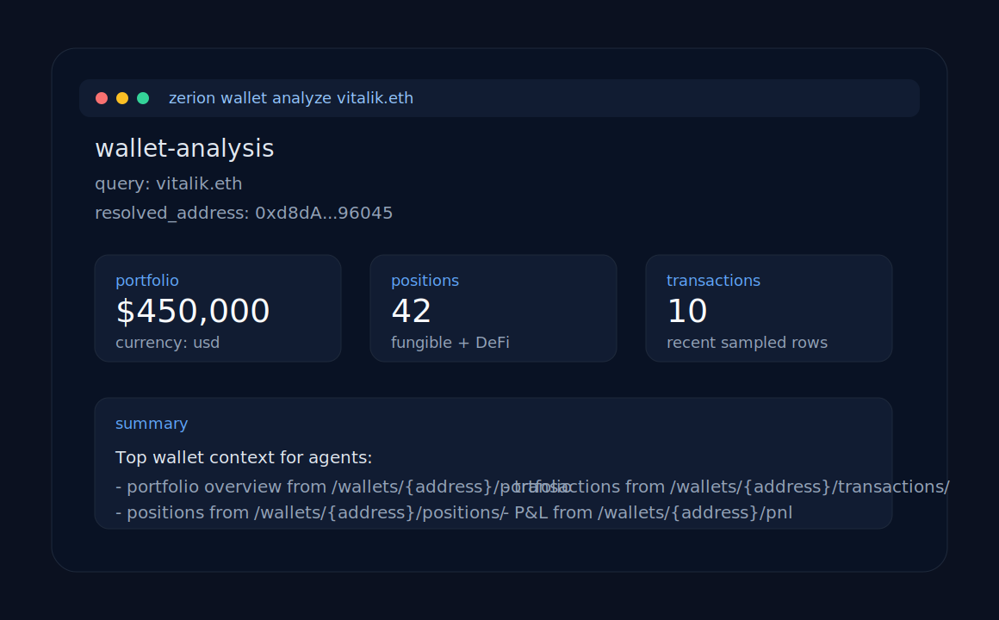

# zerion-ai

**Maintained by Zerion. This fork adds Squad Treasury — a Telegram multi-sig
agent built for the Zerion Frontier Hackathon.**

`zerion-ai` is the public, self-contained repo for using Zerion from AI agents and developer tools.

It packages three first-class integration paths:

- **Hosted MCP** for Cursor, Claude, and other MCP-native agent environments
- **`zerion`** for OpenClaw-like and command-based agent runtimes
- **`squad`** ✨ – a Telegram-based multi-sig trading agent with scoped
  policies (quorum, daily spend cap, token allowlist, time window). See
  [squad/README.md](./squad/README.md).

It ships two flagship workflows:

- **`wallet-analysis`** — portfolio, positions, transactions, and PnL analysis (agent operation)
- **`wallet-trading`** — swap, bridge, buy/sell tokens (agent operation); wallet setup, agent tokens, and policies (manual, requires passphrase)

---

## Squad Treasury (hackathon entry)

A fork-and-extend of the Zerion CLI that turns a Telegram group into a
policy-gated onchain treasury. Propose → vote → execute; every transaction
runs through a four-policy guard chain before it is signed.

```
Telegram → proposal row → quorum → spawn `zerion swap …` with
ZERION_PROPOSAL_ID → 4 policies re-verify from DB → real onchain tx
```

Start at [**squad/README.md**](./squad/README.md) for the full quickstart,
architecture diagram, and command reference. Run the tests with
`npm run test:squad` (19 assertions covering voting lifecycle + every policy
branch).

---



## 1. Choose your authentication method

### Option A: API Key

Get an API key and export it: [Get your API key](https://dashboard.zerion.io)

```bash
export ZERION_API_KEY="zk_dev_..."
```

- API auth via **HTTP Basic Auth**
- dev keys beginning with `zk_dev_`
- current dev-key limits of **120 requests/minute** and **5k requests/day**

Useful docs:

- [Build with AI](https://developers.zerion.io/reference/building-with-ai)
- [Get Wallet Data With Zerion API](https://developers.zerion.io/reference/getting-started)

### Option B: x402 Pay-per-call

**No API key needed.** Pay $0.01 USDC per request via the [x402 protocol](https://www.x402.org/). Supports EVM (Base) and Solana. The CLI handles the payment handshake automatically.

**Single key** — format is auto-detected:

```bash
export WALLET_PRIVATE_KEY="0x..."    # EVM (Base) — 0x-prefixed hex
export WALLET_PRIVATE_KEY="5C1y..."  # Solana — base58 encoded keypair
```

**Both chains simultaneously:**

```bash
export EVM_PRIVATE_KEY="0x..."
export SOLANA_PRIVATE_KEY="5C1y..."
export ZERION_X402_PREFER_SOLANA=true  # optional: prefer Solana when both are set
```

Then use the `--x402` flag:

```bash
zerion wallet analyze 0xd8dA6BF26964aF9D7eEd9e03E53415D37aA96045 --x402
```

Or enable x402 globally:

```bash
export ZERION_X402=true
zerion wallet analyze 0xd8dA6BF26964aF9D7eEd9e03E53415D37aA96045
```

## 2. Install skills (Claude Code, Cursor, OpenClaw)

```bash
npx skills add zeriontech/zerion-ai
```

This installs 4 skills into your agent:

| Skill | Description |
|-------|-------------|
| **wallet-analysis** | Analyze wallets: portfolio, positions, transactions, PnL |
| **wallet-trading** | Swap, bridge, buy/sell tokens, wallets, agent tokens, policies |
| **chains** | List supported blockchain networks |
| **zerion** | CLI setup, authentication, and troubleshooting |

The skills reference `zerion` which runs via `npx zerion` (no global install needed).

## 3. Choose your integration path

### MCP clients

Use this if your agent runtime already supports MCP.

Start here:

- [Hosted MCP quickstart](./mcp/README.md)
- [Cursor example](./examples/cursor/README.md)
- [Claude example](./examples/claude/README.md)

### OpenClaw and CLI-based agents

Use this if your framework models tools as shell commands returning JSON.

```bash
npm install -g zerion
zerion wallet analyze 0xd8dA6BF26964aF9D7eEd9e03E53415D37aA96045
```

Start here:

- [OpenClaw example](./examples/openclaw/README.md)
- [CLI usage](./cli/README.md)

## 4. Run the first wallet analysis

### MCP quickstart

1. Export your API key:

   ```bash
   export ZERION_API_KEY="zk_dev_..."
   ```

2. Add the hosted Zerion MCP config from [examples/cursor/mcp.json](./examples/cursor/mcp.json) or [examples/claude/mcp.json](./examples/claude/mcp.json)
3. Ask:

   ```text
   Analyze the wallet 0xd8dA6BF26964aF9D7eEd9e03E53415D37aA96045.
   Summarize total portfolio value, top positions, recent transactions, and PnL.
   ```

### CLI quickstart

**With API key:**

```bash
npm install -g zerion
export ZERION_API_KEY="zk_dev_..."
zerion wallet analyze 0xd8dA6BF26964aF9D7eEd9e03E53415D37aA96045
```

**With x402 (no API key needed):**

```bash
npm install -g zerion
export WALLET_PRIVATE_KEY="0x..."   # or base58 for Solana
zerion wallet analyze 0xd8dA6BF26964aF9D7eEd9e03E53415D37aA96045 --x402
```

Example output:

```json
{
  "wallet": {
    "query": "0xd8dA6BF26964aF9D7eEd9e03E53415D37aA96045"
  },
  "portfolio": {
    "total": 450000,
    "currency": "usd"
  },
  "positions": {
    "count": 42
  },
  "transactions": {
    "sampled": 10
  },
  "pnl": {
    "available": true
  }
}
```

## Example wallets

This repo uses the same public wallets across examples:

- `vitalik.eth` / `0xd8dA6BF26964aF9D7eEd9e03E53415D37aA96045`
- ENS DAO treasury / `0xFe89Cc7Abb2C4183683Ab71653c4cCd1b9cC194e`
- Aave collector / `0x25F2226B597E8F9514B3F68F00F494CF4F286491`

## What ships in this repo

- [`skills/`](./skills/): 4 agent skills installable via `npx skills add zeriontech/zerion-ai`
  - [`wallet-analysis/`](./skills/wallet-analysis/SKILL.md): portfolio, positions, transactions, and PnL analysis
  - [`wallet-trading/`](./skills/wallet-trading/SKILL.md): swap, bridge, buy/sell, wallets, agent tokens, policies
  - [`chains/`](./skills/chains/SKILL.md): supported blockchain networks reference
  - [`zerion/`](./skills/zerion/SKILL.md): CLI setup, auth, and troubleshooting
- [`mcp/`](./mcp/README.md): hosted Zerion MCP setup plus the tool catalog
- [`cli/`](./cli/): `zerion` unified CLI — wallet analysis + trading (published to npm)
- [`examples/`](./examples/): Cursor, Claude, OpenAI Agents SDK, raw HTTP, and OpenClaw setups

## Failure modes to expect

Both the MCP and CLI surfaces should handle:

- missing or invalid API key
- invalid wallet address
- unsupported chain filter
- empty wallets / no positions
- rate limits (`429`)
- upstream timeout or temporary unavailability

See [mcp/README.md](./mcp/README.md) and [cli/README.md](./cli/README.md) for the concrete behavior used in this repo.
